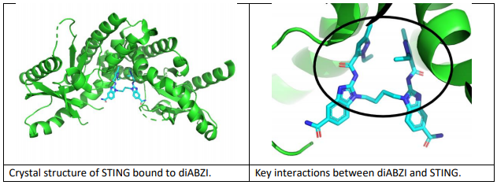

# Peter Moss Acute Myeloid & Lymphoblastic Leukemia AI Research Project

## AML & ALL Drug Discovery

# Identifying new STING activators

## Ho Leung Ng, Kansas State University

One of the most promising immunostimulatory drug targets is STING (STimulator of INterferon
Genes). STING is normally activated by cyclic dinucleotides as part of the innate immune response.
STING activation has been shown to be therapeutically effective in a mouse model of AML (Curran et al.,
2016, 2015). Molecules currently used in as STING activators in research lack chemical properties
necessary for a clinical drug, such as metabolic stability. In particular, drugs that do not share chemical similarities to cyclic dinucleotides are desired for systemic administration. The first reported STING activator with such chemical properties was reported in December 2018 by the pharmaceutical company GSK and was shown to be active in a mouse model of colon cancer (Ramanjulu et al., 2018). We seek to identify other non-cyclic dinucleotide STING activators with favorable chemical properties for drug discovery.

&nbsp;

I used the crystal structure of STING bound to the compound reported by Ramanjulu et al (PDB 6dxl)
(diABZI) to identify other molecule with similar chemical interactions with STING. I used Pharmit to
search the Chemspace database of 50M purchasable compounds to identify a subset that preserve key
interactions observed between diABZI and STING. I identified a set of 454,430 molecules for more
detailed analysis. I plan to analyze this dataset using docking and machine learning based scoring
functions.

&nbsp;

&nbsp;

Crystal structure of STING bound to diABZI.

Key interactions between diABZI and STING.

Curran, E., Chen, X., Corrales, L., Kline, D.E., Dubensky, T.W., Duttagupta, P., Kortylewski, M., Kline, J., 2016.
STING Pathway Activation Stimulates Potent Immunity against Acute Myeloid Leukemia.
Cell Reports 15, 2357–2366. https://doi.org/10.1016/j.celrep.2016.05.023

&nbsp;

Curran, E., Corrales, L., Kline, J., 2015. Targeting the Innate Immune System as Immunotherapy for Acute Myeloid Leukemia.
Front. Oncol. 5. https://doi.org/10.3389/fonc.2015.00083

&nbsp;

Ramanjulu, J.M., Pesiridis, G.S., Yang, J., Concha, N., Singhaus, R., Zhang, S.-Y., Tran, J.-L., Moore, P., Lehmann, S., Eberl, H.C., Muelbaier, M., Schneck, J.L., Clemens, J., Adam, M., Mehlmann, J.,
Romano, J., Morales, A., Kang, J., Leister, L., Graybill, T.L., Charnley, A.K., Ye, G., Nevins, N.,
Behnia, K., Wolf, A.I., Kasparcova, V., Nurse, K., Wang, L., Li, Y., Klein, M., Hopson, C.B., Guss, J.,
Bantscheff, M., Bergamini, G., Reilly, M.A., Lian, Y., Duffy, K.J., Adams, J., Foley, K.P., Gough, P.J., Marquis, R.W., Smothers, J., Hoos, A., Bertin, J., 2018.
Design of amidobenzimidazole STING receptor agonists with systemic activity.
Nature 564, 439. https://doi.org/10.1038/s41586-018-0705-y

&nbsp;

# Contributing

The Peter Moss Leukemia Research Foundation & Peter Moss Acute Myeloid & Lymphoblastic Leukemia AI Research project encourages and welcomes code contributions, bug fixes and enhancements from the Github community.

Please read the [CONTRIBUTING](https://github.com/AMLResearchProject/AML-ALL-Drug-Discovery/blob/master/CONTRIBUTING.md "CONTRIBUTING") document for a full guide to forking our repositories and submitting your pull requests. You will also find information about our code of conduct on this page.

## Team Contributors

The following Peter Moss Acute Myeloid & Lymphoblastic Leukemia AI Research project team members have contributed towards this repository:

- [Ho Leung Ng](https://www.leukemiaresearchfoundation.ai/team/ho-leung-ng/profile "Ho Leung Ng") - Peter Moss Leukemia Research Foundation. Kansas, USA

&nbsp;

# Versioning

We use SemVer for versioning. For the versions available, see [Releases](https://github.com/AMLResearchProject/AML-ALL-Drug-Discovery/releases "Releases").

# License

This project is licensed under the **MIT License** - see the [LICENSE](https://github.com/AMLResearchProject/AML-ALL-Drug-Discovery/blob/master/LICENSE.md "LICENSE") file for details.

# Bugs/Issues

We use the [repo issues](https://github.com/AMLResearchProject/AML-ALL-Drug-Discovery/issues "repo issues") to track bugs and general requests related to using this project.

