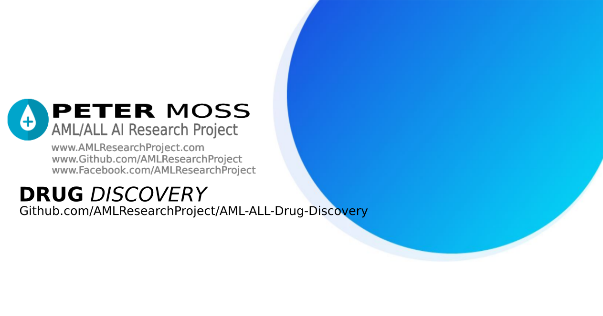
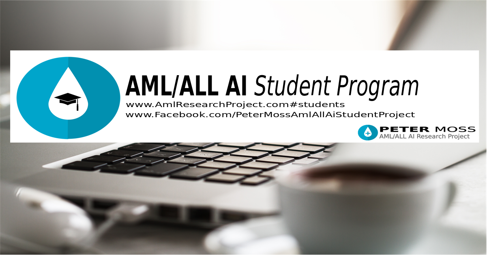

# Peter Moss Acute Myeloid/Lymphoblastic Leukemia Drug Discovery Research & Development

# Drug Discovery Project Intro

The Peter Moss Acute Myeloid/Lymphoblastic Leukemia Drug Discovery repository is collection of research and development projects for drug discovery. These projects use various methods of Artificial Intelligence to identify possible candidates for drugs to help combat Acute Myeloid & Acute Lymphoblastic Leukemia.

This area of the project is headed by [Ho Leung Ng](https://github.com/orgs/AMLResearchProject/people/holeung "Ho  Leung Ng") - Kansas State University, Dept. Biochemistry & Molecular Biophysics & Intel Software Innovator.

# About The AML Drug Discovery Problem

Most current cancer drug research is on the discovery of targeted drugs. Targeted drugs are usually
designed to block (in most cases) or activate a specific target protein. The targets are proteins that are either mutated or over expressed in the cancer relative to normal cells. Targeted drugs are usually less toxic than cytotoxic drugs. If the proper target for a cancer is identified, targeted drugs can be extremely effective.

Much research is required to properly identify potential targets for each subtype of cancer. For AML, the different subtypes are usually associated with distinct sets of targets. A good starting point to learn about AML targets is the Tyner et al paper published in 2018 in Nature v562, 526. Once a target is identified, researchers usually experimentally screen thousands of compounds to identify those that are active in an approach called high-throughput screening. This is too costly for all but drug companies and a few highly resourced academic labs. Alternatively, if the 3D structure of the target protein is known, one can computationally screen compounds by calculating their chemical fit to the binding site. The highest scoring compounds are tested experimentally. One can apply ML methods and develop new ways of scoring compounds.

_[Read full article by Ho Leung Ng](https://github.com/orgs/AMLResearchProject/people/holeung "Read full article by Ho  Leung Ng") - Kansas State University, Dept. Biochemistry & Molecular Biophysics - Intel Software Innovator_

## Potential Research Projects

Ideas for potential projects for the Peter Moss Acute Myeloid/Lymphoblastic Leukemia Drug Discovery Research & Development

1. Discovery of anthracyclines that are predicted to be less cardiotoxic.
2. Discovery of anthracyclines that are predicted to be less associated with drug resistance.
3. Identify new AML targets from the Tyner et al paper, especially those which have only been lightly
   studied. Find molecules to block these targets.
4. Choose immunomodulatory targets such as STING. Identify new bioactive molecules for these targets.
5. Develop models that can predict cardiotoxicity based on chemical structure of drugs.

_[Read full article by Ho Leung Ng](https://github.com/orgs/AMLResearchProject/people/holeung "Read full article by Ho  Leung Ng") - Kansas State University, Dept. Biochemistry & Molecular Biophysics - Intel Software Innovator_

# ORGANIC (Objective-Reinforced Generative Adversarial Network for Inverse-design Chemistry)

ORGANIC (Objective-Reinforced Generative Adversarial Network for Inverse-design Chemistry) is an efficient molecular generation tool, able to create molecules with desired properties. It has a user-oriented interface, and doesn't require a HPC cluster. Feel free to check our article about ORGANIC and/or contact the developers if you have any issue or are interested in collaborations.

Thanks to project team member Ho Leung Ng, the team has been granted permission from the owners of ORGANIC to integrate their project into the Peter Moss Acute Myeloid/Lymphoblastic Leukemia Drug Discovery Research & Development which we the team are very grateful for!

# About The Peter Moss Acute Myeloid/Lymphoblastic Leukemia AI Research Project

The Peter Moss Acute Myeloid / Lymphoblastic Leukemia AI Research Project is an open source project with the goals of leveraging Artificial Intelligence to help detect AML/ALL and discover potential candidates for drugs to help combat the diseases. The project is in memory of Peter Edward Moss who lost his battle with Acute Myeloid Leukemia in August 2019.

The project is being coordinated by a group of volunteers with experience in computer vision / natural language processing, Leukemia research, Biochemistry, Molecular Biophysics, Immunology and Bioinformation.

The purpose of the project is to share public information related to AML/ALL, as well as open source projects aimed at early dectection with convolutional neural networks, using natural language understanding for AML/ALL chatbots, and R&D for discovering potential candidates for drugs for AML/ALL.

## Project Team

The official team is currently made up of:

- [Adam Milton-Barker](https://github.com/orgs/AMLResearchProject/people/AdamMiltonBarker "Adam Milton-Barker") - Bigfinite IoT Network Engineer & Intel Software Innovator

- [Ho Leung Ng](https://github.com/orgs/AMLResearchProject/people/holeung "Ho  Leung Ng") - Kansas State University, Dept. Biochemistry & Molecular Biophysics - Intel Software Innovator

- [Amita Kapoor](https://github.com/orgs/AMLResearchProject/people/amita-kapoor "Amita Kapoor") - Associate Professor @ Delhi University, New Dehli, India

- [Estela Cabezas](https://www.facebook.com/Esteeelaa "Estela Cabezas") - Degree in Biotechnology @ Universitat de Vic, Catalunya, Spain - Intel Software Innovator

- [Salvatore Raieli​](https://github.com/orgs/AMLResearchProject/people/SalvatoreRa "Salvatore Raieli​") - Salvatore Raieli attended a Biotechnology degree at a university in Paris for his PhD.

- [Rishabh Banga](https://github.com/orgs/AMLResearchProject/people/rishabhbanga "Rishabh Banga")​ - Software Dev @ Seamens & Intel Software Innovator

# The Peter Moss Acute Myeloid / Lymphoblastic Leukemia AI Student Program

The Peter Moss Aml/All AI Student Program​ provides college & university students with real world projects & experience in working with AI for medical purposes, helping further their education and understanding of real world medical AI systems.

The Student Program is headed by Peter Moss Aml/All AI Research Project​ team members [Ho Leung Ng](https://github.com/orgs/AMLResearchProject/people/holeung "Ho  Leung Ng")​ - Dept. Biochemistry & Molecular Biophysics @ Kansas State University, and [Amita Kapoor](https://github.com/orgs/AMLResearchProject/people/amita-kapoor "Amita Kapoor") - Associate Professor @ Delhi University.

If you would like to join the Student Developer Program please answer the questions on the [Private AML/ALL AI Student Program Chat Group​](https://www.facebook.com/groups/AmlAllPrivateStudentAiProgram "Private AML/ALL AI Student Program Chat Group​").

# Professional Volunteers

If you would like to volunteer to the research project or student program as a professional, please use the contact form on our website and select **Professional Volunteer**.

# Community Driven

The project was initially created with the hope other developers and people in the medical industry may find the software and tutorials useful, and may contribute back to the Github community helping improve the project. Feel free to submit pull requests with your suggested edits / bug fixes / additions to the related repositories on Github.

# Contributing

We welcome contributions of the project. Please read [CONTRIBUTING.md](https://github.com/AMLResearchProject/AML-ALL-Drug-Discovery/blob/master/CONTRIBUTING.md "CONTRIBUTING.md") for details on our code of conduct, and the process for submitting pull requests.

# Versioning

We use SemVer for versioning. For the versions available, see [Releases](https://github.com/AMLResearchProject/AML-ALL-Drug-Discovery/releases "Releases").

# License

This project is licensed under the **MIT License** - see the [LICENSE](https://github.com/AMLResearchProject/AML-ALL-Drug-Discovery/blob/master/LICENSE "LICENSE") file for details.

# Bugs/Issues

We use the [repo issues](https://github.com/AMLResearchProject/AML-ALL-Drug-Discovery/issues "repo issues") to track bugs and general requests related to using this project.
